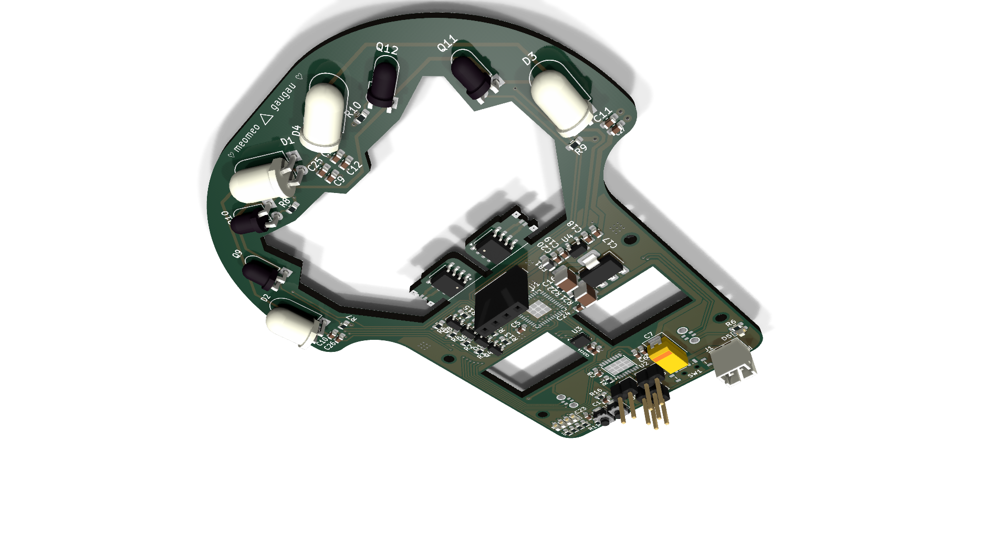
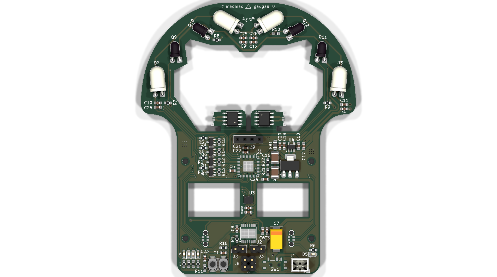
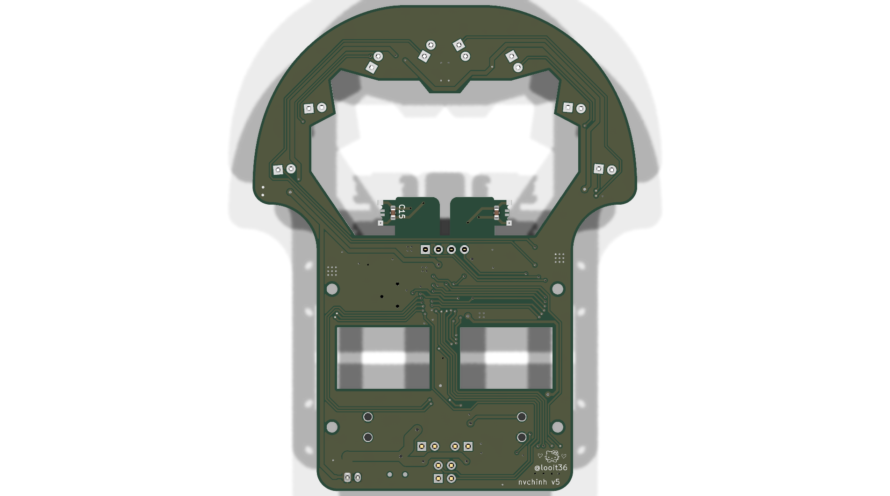
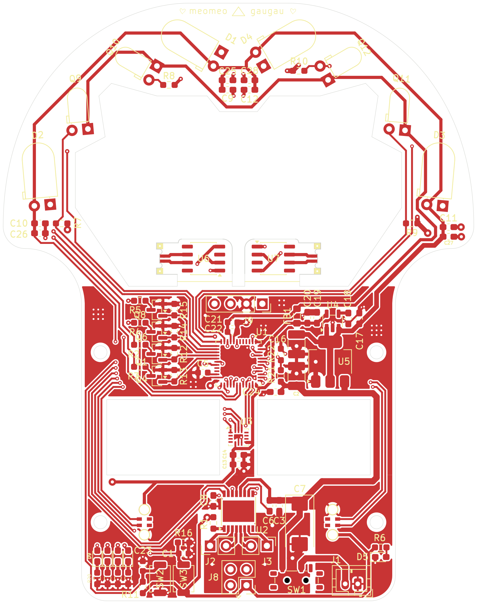
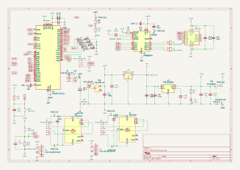
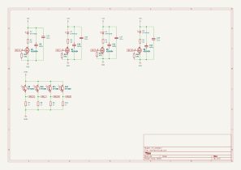

# MiniChinh - Micromouse Robot Controller Board

Dự án thiết kế mạch điều khiển robot dò mê cung (Micromouse) sử dụng phần mềm **KiCad**. Mạch tích hợp vi điều khiển STM32F411 tốc độ cao, driver động cơ kép, cảm biến quán tính IMU 6 trục, cảm biến encoder từ tính và dàn cảm biến quang hồng ngoại (IR).

---

## 📸 Hình ảnh Mạch PCB (3D & 2D Layout)

### Phối cảnh 3D (3D Isometric View)


### Mặt trước & Mặt sau PCB (3D Render)
| Mặt trên (Top View) | Mặt dưới (Bottom View) |
| :---: | :---: |
|  |  |

### Bản vẽ Layout 2D
| Layout Mặt trước (F.Cu + Silk) | Layout Mặt sau (B.Cu + Silk) |
| :---: | :---: |
|  |  |

---

## 📐 Sơ đồ Nguyên lý (Schematic)

> [!NOTE]  
> Bản vẽ Schematic dưới đây ở định dạng vector SVG sắc nét. Bạn cũng có thể xem/tải toàn bộ tài liệu schematic dạng PDF tại: [minichinh_schematic.pdf](images/minichinh_schematic.pdf).

### 1. Sơ đồ khối chính (Main Schematic)


### 2. Sơ đồ mạch phát & thu hồng ngoại (IR Emitter & Sensor)


---

## ⚙️ Thông số Kỹ thuật Phần cứng

| Thành phần | Chi tiết linh kiện | Chức năng |
| :--- | :--- | :--- |
| **Vi điều khiển (MCU)** | STM32F411CEU6 (UFQFPN-48) | ARM Cortex-M4 100MHz, 512KB Flash, 128KB SRAM |
| **Driver Động cơ** | TI DRV8833PW (HTSSOP-16) | Điều khiển 2 động cơ DC độc lập, dòng tối đa 1.5A/kênh |
| **Cảm biến góc (IMU)** | Bosch BMI160 (LGA-14) | Cảm biến gia tốc & con quay hồi chuyển 6 trục (SPI/I2C) |
| **Bộ mã hóa bánh xe (Encoder)** | 2x MT6701CT (SO-8) | Cảm biến góc từ tính độ chính xác cao cho 2 bánh xe |
| **Cảm biến khoảng cách / Mê cung** | 4x SFH4546 (IR LED) + 4x SFH300 (Phototransistor) | Đo khoảng cách các vách tường mê cung, lái bằng MOSFET AO3400A |
| **Mạch nguồn (Power)** | AMS1117-5.0 & TI TPS73633DBV | Ổn áp 5V và 3.3V Low-Dropout cấp nguồn ổn định cho MCU và cảm biến |
| **Giao tiếp lập trình** | Cổng SWD chuẩn (GND, 3V3, SWDIO, SWCLK) | Nạp và gỡ lỗi bằng ST-Link / J-Link |
| **Ngoại vi & UI** | 5x LED báo trạng thái SMD 0603, 2x nút nhấn, 1x công tắc nguồn MSK12C02 | Giao diện tương tác và chọn chế độ chạy |

---

## 📁 Cấu trúc Thư mục

```text
minichinh/
├── minichinh.kicad_pro       # File dự án KiCad chính
├── minichinh.kicad_sch       # Sơ đồ nguyên lý chính
├── iremitter.kicad_sch       # Sơ đồ nguyên lý khối IR Emitter
├── minichinh.kicad_pcb       # Bản vẽ thiết kế mạch in PCB
├── fp-lib-table              # Bảng thư viện footprint
├── mouse.pretty/             # Thư viện footprint tùy chỉnh cho robot
├── minichinh.csv             # Danh sách bảng linh kiện (BOM)
├── geber/                    # Bộ file Gerber sẵn sàng để đặt mạch gia công
├── images/                   # Hình ảnh sơ đồ schematic và render 3D / 2D PCB
│   ├── minichinh.svg
│   ├── minichinh_ir_emitter.svg
│   ├── minichinh_schematic.pdf
│   ├── pcb_3d_top.png
│   ├── pcb_3d_bottom.png
│   ├── pcb_3d_iso.png
│   ├── pcb_top_layout.svg
│   └── pcb_bottom_layout.svg
└── README.md                 # Tài liệu giới thiệu dự án
```

---

## 🚀 Hướng dẫn Sử dụng

1. **Mở dự án:**
   - Cài đặt [KiCad](https://www.kicad.org/) phiên bản 8.0 hoặc 9.0 trở lên.
   - Mở file `minichinh.kicad_pro` để truy cập sơ đồ nguyên lý và layout PCB.
2. **Gia công mạch (PCB Manufacturing):**
   - Bộ file Gerber nén và đầy đủ các lớp đã được tạo sẵn trong thư mục [`geber/`](geber/). Có thể gửi trực tiếp cho các nhà sản xuất PCB (JLCPCB, PCBWay, v.v.).
